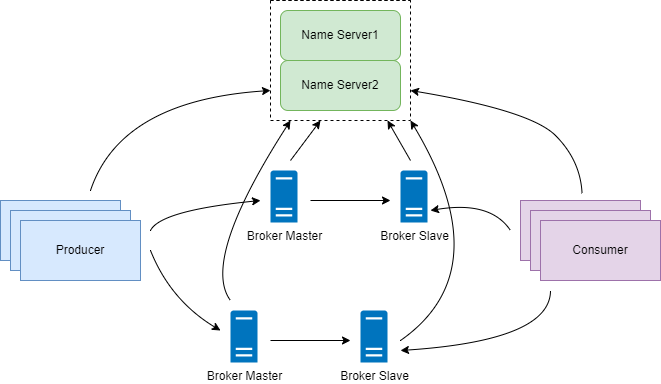

### 一、[注册中心放弃zookeeper原因](https://blog.csdn.net/zjj2006/article/details/126199462)

RocketMQ 的 Broker 注册到 NameServer 集群，而生产者和消费者则需要从 NameServer 拉取消息。结构图如下：


RocketMq一开始也是使用ZK作为注册中心的，ZK是一个非常成熟的注册中心，节点选举、强一致性等，如果选择ZK作为注册中心架构如下：


### 二、代码分析
#### 2.1 Broker注册
Broker 启动时，会向 NameServer 发送注册消息，相关的 UML：

主要看 `org.apache.rocketmq.broker.out.BrokerOuterAPI.registerBrokerAll` .
可以看到，当 Broker 启动时，会向所有的 NameServer 发送注册消息，NameServer 端的注册内容如下：

从上图中看出，需要在 NameServer 上保存的数据其实是很少的。
#### 2.2 客户端
对于生产者和消费者，在发送和拉取消息时，首先会从本地缓存获取 Topic 路由信息，如果获取失败，则需要从 NameServer 进行获取。下面是获取 Topic 路由信息的 UML 类图：

注意：客户端会有定时任务，默认每隔 30s 向 NameServer 拉取 Topic 路由信息来刷新本地缓存。


### 三、放弃ZK好处：
#### 1. 轻量级
rocketMQ需要保存的数据非常少，完全不必要引入Zookeeper这种重量级的注册中心。

#### 2. 一致性
NameServer 集群各节点是对等的，相互之间并不会进行通信，这样确实会有短暂不一致。Broker 启动时会跟所有的 NameServer 建立长链接，发送注册信息。注册成功后，每 30s 会向 NameServer 发送心跳，NameServer 收到心跳后更新 Broker 的 lastUpdateTimestamp。
Zookeeper 使用 ZAB 协议来保证节点之间数据的强一致性，这要求在每一个写请求都需要在节点上写事务日志，同时需要将内存数据持久化到磁盘以保证一致性和持久性。对于 RocketMQ 这种元数据非常少的简单场景，有点小题大做了。
放弃强一致而选择可用性也是 RocketMQ 放弃 Zookeeper 的选择，这也让 NameServer 的设计更加简单。
#### 3. 并发注册
NameServer 处理 Broker 注册的时候，考虑到多个 Broker 并发注册的问题，保存路由信息时采用了 ReadWriteLock 中的写锁，代码如下：
```aidl
org.apache.rocketmq.broker.out.BrokerOuterAPI.registerBroker
```
#### 4. broker上下线
如果有新的 Broker 加入时，NameServer 并不会主动向客户端推送新的 Broker 信息，而是需要客户端的定时任务（30s 一次）去主动拉取，这样客户端保存的路由信息跟 NameServer 会有短暂的不一致。
同样，Broker 掉线后，NameServer 会用定时任务（10s 一次）检测 Broker 最后更新时间是否超过 120s，如果超过就把 Broker 路由信息删除。在客户端，同样需要定时任务（30s 一次）去主动拉取，客户端保存的路由信息跟 NameServer 也会有短暂的不一致。


#### 5. 扩展性
从上面分析看到，NameServer 集群各节点是对等的，当集群有压力时，横向扩展非常容易。而 Zookeeper 在写扩展方面非常不灵活。
#### 6. broker主从集群
在 Broker 主从集群中，RocketMQ 实现了基于 raft 协议的 DLedger 算法，可以基于 DLedger 进行日志复制。如果 Master 节点发生故障，可以基于 DLedger 自动进行主从切换。这可以完全不依赖于 Zookeeper 的实现。

#### 7. 运维
如果引入 Zookeeper，运维人员必须要具备运维 Zookeeper 的能力，这又增加了运维的复杂性。NameServer 是 RocketMQ 内部组件，实现简单，易于扩展，不用考虑运维复杂性。


